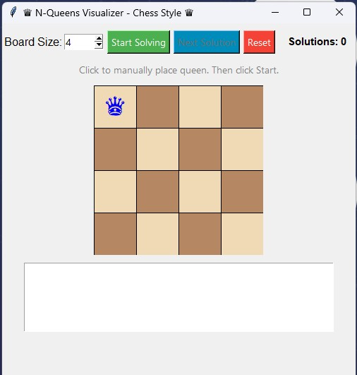

# ♛ N-Queens Visualizer - Chess Style ♛

[](https://opensource.org/licenses/MIT)
[](https://www.python.org/downloads/)
[](https://docs.python.org/3/library/tkinter.html)

<div align="center">
  
  
  *A beautiful, interactive visualization of the N-Queens problem solution using backtracking*
</div>

---

## 🎮 Quick Start

### Windows Users
[](https://github.com/jiaamasum/nqueens-visualizer/raw/main/n_queens_visualizer.exe)

Just download and run! No Python installation required.

### Python Users
```bash
# Clone the repository
git clone https://github.com/jiaamasum/nqueens-visualizer.git
cd nqueens-visualizer

# Install dependencies
pip install pillow

# Run the visualizer
python n_queens_visualizer.py
```

---

## ✨ Features

<div align="center">
  
</div>

- 🎯 **Interactive Chess Board**
  - Beautiful chess-style interface
  - Click to place queens manually
  - Real-time validation

- 🔄 **Dynamic Solving**
  - Animated backtracking visualization
  - Step-by-step solution process
  - Multiple solution discovery

- ⚙️ **Customization**
  - Adjustable board size (4x4 to 16x16)
  - Solution history tracking
  - Manual and automatic modes

---

## 🎥 Demo Video

[](https://github.com/jiaamasum/nqueens-visualizer/raw/main/%E2%99%9B%20N-Queens%20Visualizer%20-%20Chess%20Style%20%E2%99%9B.mp4)

---

## 📝 How to Use

1. **Launch the Application**
   - Run the `.exe` file (Windows) or
   - Execute `python n_queens_visualizer.py`

2. **Choose Board Size**
   - Use the spinbox to select size (4-16)
   - Click "Reset" to clear the board

3. **Place Queens (Optional)**
   - Click on cells to place queens manually
   - Invalid positions are automatically prevented

4. **Solve**
   - Click "Start Solving" to begin visualization
   - Use "Next Solution" to find more solutions
   - Watch the backtracking algorithm in action!

---

## 🛠️ Technical Requirements

- **For Python Users:**
  - Python 3.x
  - Tkinter (included with Python)
  - PIL (Pillow) >= 9.0.0

- **For Windows Users:**
  - No requirements! Just download and run the `.exe`

---

## 📚 Implementation Details

The visualizer implements the classic backtracking algorithm for the N-Queens problem with these key features:

- Real-time constraint checking
- Visual state management
- Interactive UI with Tkinter
- Solution history tracking
- Animated backtracking steps

---

## 📄 License

This project is licensed under the MIT License - see the [LICENSE](LICENSE) file for details.

---

## 👤 Author

**jiaamasum**
- GitHub: [@jiaamasum](https://github.com/jiaamasum)

---

<div align="center">
  <i>If you found this project helpful, please consider giving it a ⭐️!</i> 